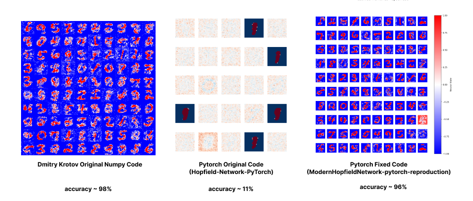

# ModernHopfieldNetwork PyTorch Reproduction

A PyTorch reproduction of the Modern Hopfield Network implementation based on "Dense Associative Memory for Pattern Recognition" (Krotov and Hopfield, 2016). This project aims to accurately reproduce the paper's results using PyTorch's GPU acceleration capabilities.

## Project Background

This work began as an improvement upon the implementation at [Hopfield-Network-PyTorch](https://github.com/hmcalister/Hopfield-Network-PyTorch). Initial analysis revealed significant performance differences between the original PyTorch implementation and Krotov's results:



- Original PyTorch implementation achieved only ~11% accuracy
- Memories were not functioning properly as prototypes

## Improvements

Several key modifications were made to align the implementation with the original paper:
- Adjusted all parameters to match paper specifications
- Corrected beta parameter implementation
- Modified memory initialization methodology
- Modified temperature parameter implementation
- ...

These changes resulted in:
- Improved accuracy from ~11% to ~96%, matching the paper's results
- Proper prototype behavior of memories:

## Installation

Clone this repository and navigate to the project root directory:
```bash
git clone https://github.com/hmcalister/ModernHopfieldNetwork-pytorch-reproduction.git
cd ModernHopfieldNetwork-pytorch-reproduction
```

## Usage

run the following command to train the network on the MNIST dataset:
you can see the results in the logs directory

```bash
python modernHopfieldMNIST.py
```

## References

- Krotov, D., & Hopfield, J. J. (2016). Dense Associative Memory for Pattern Recognition. Advances in Neural Information Processing Systems, 29, 1172-1180.

